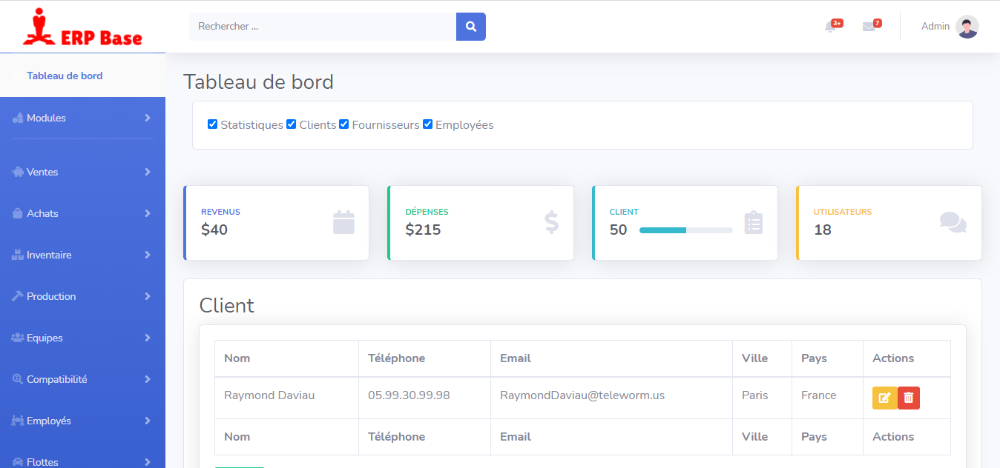

## Introduction

ERP Base is a Modern and responsive small Business management system. It is designed and develops for thinking shop, small business, company and any types of business. Here has accounting, management, invoice,user and data analysis.

## Informations
-   Status: under development
-   Lastest version 1.0
-   Sector: finance
-   Created: December 2020
-   Last updated: December 2020

## Table of contents
* [Documentation](#general-info)
* [Demo](#demo)
* [Screenshots](#screenshots)
* [Technologies](#technologies)
* [Setup](#setup)
* [Features](#features)
* [Status](#status)
* [Contact](#contact)
* [License](#license)

## Documentation
https://github.com/aniskchaou/ERPBASE-FRONTEND-ADMIN/wiki

## Demo
https://erpbase.herokuapp.com

## Screenshots

## Technologies
* Spring boot
* Angular

## Setup

## Features
 -  

  

## Contact
contact@delta-dev-software.com

## License
<a href="license.txt">MIT License</a>